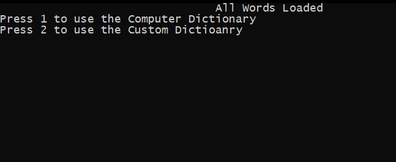
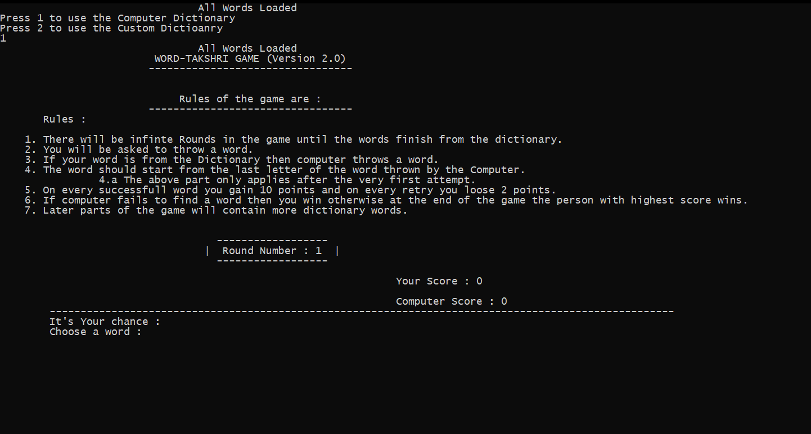
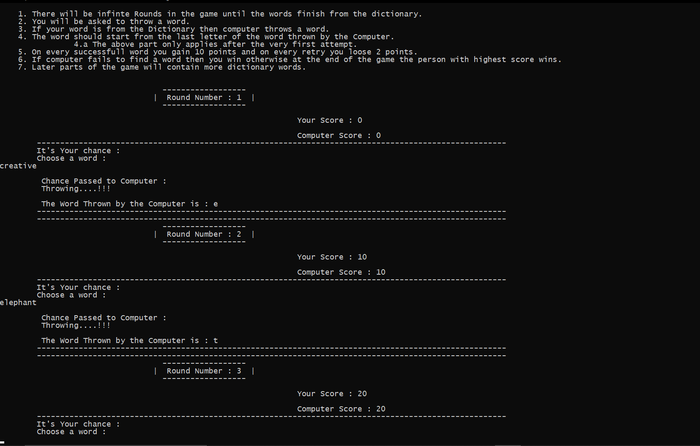
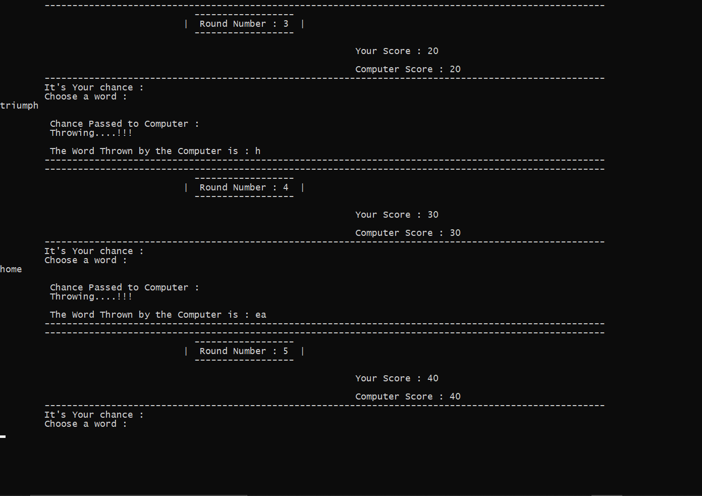
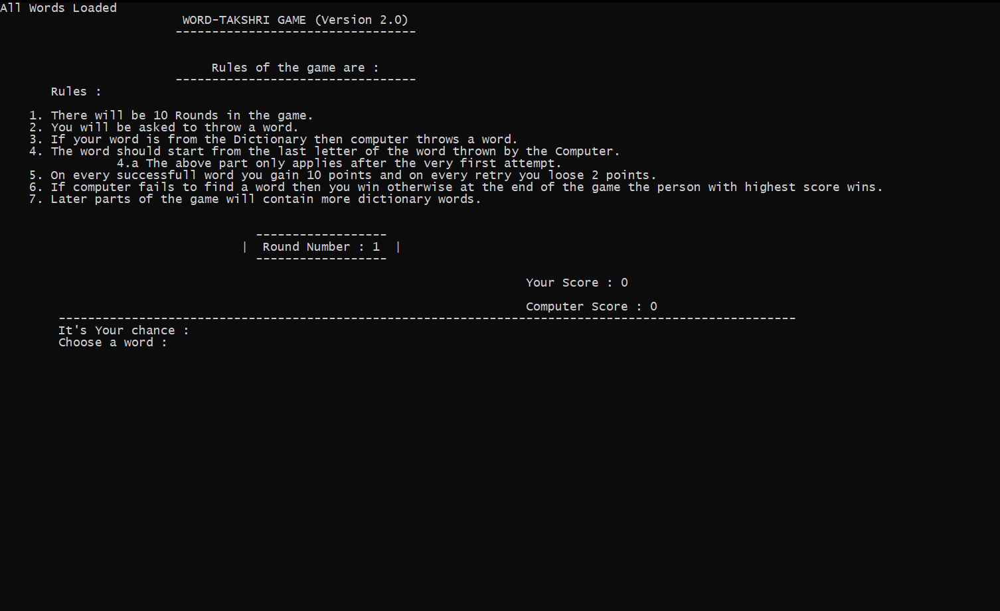

# WordTakshri : Word-Antakshri
A Terminal game implemented on C++ language
This is a revamp of the most famous and familiar game of Atakshri which is built over the concept of Dictionary Words named as Wordtakshri.

# Link : 
https://drive.google.com/drive/folders/1TB7cKuLolpoMhgsj4XaG0-xRSGTQO7nj?usp=sharing

* Link contains the game project.
* Video preview of the game.

# Screenshot : 

# Aim
Aim of this game is to provide entertainment and refresh some old memories

# System Requirements
* Windows 10 pro
* Visual Studios 17 or above
* Core i5 processors 7th gen or above recomended

# Getting Started
Start by downloading the project from given link at the top.
* Visual Studios 2019 recommended.
* Notepad.
###                or
* Visual studios code.
* Mingw C/C++ compiler               
                
# Main features :
* A complete game.
* Updates Scores.
* User can use his/her own dictionary.
* Game has infinite round.
* Helps a person learn new words.

## Download and enjoy.
